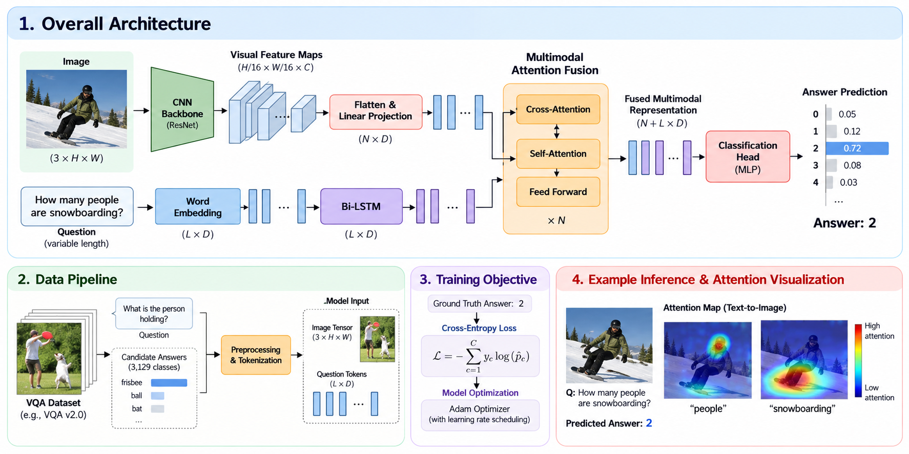

# VQA 성능 개선 분석

> Kaggle baseline **0.70837** → 개선 모델 **0.95829**  
> 발표자료 제작용 Markdown · 분석 대상: `(260908)_baseline_colab.ipynb`, `enhanced_baseline_colab.ipynb`

---

<!-- provlem_solve/{일자}/{스터디멤버 깃헙 id} 형태로 파일을 생성할 때 사용됩니다.  -->
## Team
<table>
  <tr>
    <td align="center"><a href="https://github.com/Nerororo"></a></td>
    <td align="center"><a href="https://github.com/NewOld21"></a></td>
    <td align="center"><a href="https://github.com/77romin"></a></td>
  </tr>
  <tr>
    <td align="center"><a href="https://github.com/Nerororo"><b>김동준</b></a></td>
    <td align="center"><a href="https://github.com/NewOld21"><b>김세헌</b></a></td>
    <td align="center"><a href="https://github.com/77romin"><b>김강민</b></a></td>
  </tr>
  
</table>

## 1. Executive Summary

개선 버전은 단순히 모델 크기만 키운 코드가 아니다. **데이터 신뢰성 → 학습 목표 → 모델 용량과 시각 해상도 → 추론 의사결정 → 제출 안정성**을 한 흐름으로 다시 설계했다.

- Kaggle 점수는 **0.70837에서 0.95829로 0.24992 상승**, 즉 **+24.992%p** 개선되었다.
- 정확도의 상대 증가율은 약 **35.28%**이다.
- 오류율은 **29.163%에서 4.171%로 감소**해, 기존 오류의 약 **85.70%를 제거**했다.
- 가장 중요한 구조적 개선은 다음 다섯 가지다.
  1. 200개만 쓰던 학습을 전체 train 기반으로 확대
  2. 3B·384×384 고정 입력에서 9B·최대 768 image token으로 확장
  3. 프롬프트 전체를 예측하던 잘못된 loss를 assistant 정답 구간 중심으로 수정
  4. 자유 생성 후 문자열 파싱을 네 후보의 conditional log-probability 비교로 교체
  5. 중복 이미지 누수를 방지하는 group split과 제출 전 검증을 추가

**한 문장 결론:** 기존 코드는 “VQA 정답 선택”보다 “긴 프롬프트 복원”을 많이 학습하고, 추론에서는 생성·파싱 오류까지 떠안았다. 개선 코드는 과제를 **네 후보 중 가장 가능성 높은 답을 안정적으로 고르는 문제**로 정렬했다.

## 모델 구조 시각화

아래 그림은 데이터 전처리부터 멀티모달 특징 융합, 학습 목표, 정답 예측과 어텐션 시각화까지 VQA 파이프라인의 전체 흐름을 보여준다.



### 해석 시 주의

- 두 노트북에는 저장된 실행 결과와 execution count가 없다. 따라서 **0.70837과 0.95829는 사용자 제공 Kaggle 결과**이며, 이 문서가 독립적으로 재실행해 확인한 점수는 아니다.
- 개선판은 여러 변경을 동시에 적용했다. 별도 ablation 결과가 없으므로 “어느 변경이 몇 점을 올렸다”는 인과 배분은 할 수 없다.
- ensemble, dev 포함 최종 학습 등은 코드에 기능이 존재하지만 기본 설정상 실제 사용되지 않는다. **구현된 기능과 0.95829 제출에 실제 사용된 기능을 동일시하면 안 된다.**

---

## 2. 점수 변화

| 지표                    | 기존 baseline | 개선 baseline |          변화 |
| ----------------------- | ------------: | ------------: | ------------: |
| Kaggle score / accuracy |       0.70837 |       0.95829 |  **+0.24992** |
| 백분율 환산             |       70.837% |       95.829% | **+24.992%p** |
| 오류율                  |       29.163% |        4.171% | **−24.992%p** |
| 기존 오류 대비 감소율   |             — |             — |    **85.70%** |

> 발표 메시지: “정확도가 약 25%p 올랐고, 틀리던 문제의 약 86%를 추가로 해결했다.”

---

## 3. 전체 비교표

| 영역           | 기존 baseline                         | 개선 baseline                                    | 기대 효과                     |
| -------------- | ------------------------------------- | ------------------------------------------------ | ----------------------------- |
| 데이터 사용    | train에서 무작위 **200개만 사용**     | 전체 train을 감사 후 train/valid로 분할          | 데이터 다양성·일반화 향상     |
| dev 활용       | 로드하지 않음                         | 5개 응답을 다수결 label로 만들고 별도 진단       | 모델 선택 근거 강화           |
| 데이터 검증    | 사실상 없음                           | 열·ID·결측·이미지 누락·제출 순서 검사            | 조용한 데이터 오류 방지       |
| 중복 처리      | 일반 random split                     | SHA-256 + pHash 군집, image group-safe split     | validation 누수 억제          |
| base model     | Qwen2.5-VL-3B-Instruct                | Qwen3.5-9B                                       | 시각·언어 추론 용량 확대      |
| 정밀도         | 4-bit NF4 QLoRA, FP16 compute 설정    | BF16 base + LoRA                                 | 양자화 손실 감소, A100 활용   |
| 이미지 입력    | `min=max=384×384`                     | 256~768 image token 범위                         | 작은 글자/OCR 정보 보존       |
| LoRA           | rank 8, attention+MLP                 | rank 16, text attention 계열, vision freeze 검사 | 적응 용량 확대·학습 범위 통제 |
| 학습 label     | `labels = input_ids.clone()`          | prompt/padding mask 후 assistant target만 활성   | 학습 목표를 정답 선택에 정렬  |
| 선택지 순서    | 항상 a→b→c→d                          | 학습 시 무작위 permutation                       | 위치 편향 완화                |
| 유효 batch     | 1×4 = 4                               | 2×8 = 16                                         | gradient 안정성 향상          |
| optimizer 전략 | LR 1e-4, linear schedule              | LR 5e-5, cosine, warmup, grad clipping           | 안정적 미세조정               |
| validation     | 20개의 잘못 마스킹된 loss             | group-safe split의 accuracy + 전체 dev 진단      | 실제 metric과 정렬            |
| 추론           | 최대 2 token 자유 생성 후 문자열 파싱 | a/b/c/d 각각의 조건부 log-probability 비교       | 파싱 실패·생성 변동 제거      |
| 위치 편향 보정 | 없음                                  | cyclic permutation score 평균                    | 특정 글자 위치 선호 감소      |
| 장애 대응      | 중간 저장·재개 없음                   | checkpoint, smoke test, 추론 재개, atomic CSV    | 장시간 작업의 실패 비용 감소  |
| 제출 생성      | 새 DataFrame을 직접 저장              | sample schema·ID 순서·중복·답 범위 검증          | 형식 오류 방지                |
| 재현성         | seed만 일부 고정                      | split 파일/hash, config, model SHA 기록 시도     | 실험 추적성 향상              |

---

## 4. 기존 코드의 문제점

### 4.1 학습 데이터의 200개 제한

기존 코드는 전체 train을 읽은 직후 다음과 같이 200개만 남긴다.

```python
train_df = train_df.sample(n=200, random_state=SEED).reset_index(drop=True)
```

이후 90:10으로 나누므로 실제 학습은 약 **180개**, 검증은 **20개**다. VQA는 이미지 유형, 질문 표현, OCR 난이도, 선택지 패턴이 다양하기 때문에 이 규모로는 분포를 충분히 학습하기 어렵다. 20개 validation loss 역시 분산이 커 모델 품질을 안정적으로 대표하기 힘들다.

### 4.2 가장 치명적인 문제: 프롬프트 전체에 loss 적용

기존 collator는 아래 한 줄로 입력 전체를 label로 복사한다.

```python
enc["labels"] = enc["input_ids"].clone()
```

그 결과 모델은 정답 한 글자뿐 아니라 system instruction, 질문, 네 선택지, chat template의 특수 token까지 다음 token으로 복원하도록 학습된다. 배치 padding이 발생하면 padding도 `-100`으로 제외하지 않는다.

정답 신호는 전체 sequence 중 극히 일부이므로 gradient 대부분이 “문제 문장을 다시 예측하는 일”에 사용된다. 대회의 목적은 **정답 문자 분류**인데, 학습 목적은 **프롬프트 언어모델링**에 가까워진다.

> 핵심 진단: 모델이 틀린 일을 열심히 학습하도록 loss가 설계되어 있었다.

### 4.3 단순 split과 validation metric 불일치

```python
split = int(len(train_df) * 0.9)
train_subset, valid_subset = train_df.iloc[:split], train_df.iloc[split:]
```

- class stratification이 없다.
- 같은 이미지나 거의 같은 이미지가 양쪽에 들어가는지 검사하지 않는다.
- competition metric인 accuracy가 아니라, 잘못 마스킹된 전체-sequence loss만 본다.
- dev.csv를 활용하지 않는다.

따라서 validation loss가 좋아져도 Kaggle accuracy가 좋아진다는 보장이 약하다.

### 4.4 작은 모델과 강한 정보 압축

기존은 `Qwen/Qwen2.5-VL-3B-Instruct`를 4-bit NF4로 로드하고 이미지를 정확히 384×384 pixel로 제한한다.

```python
min_pixels = IMAGE_SIZE * IMAGE_SIZE
max_pixels = IMAGE_SIZE * IMAGE_SIZE
```

이는 메모리 절약에는 유리하지만 작은 글자, 표, 간판, 문서형 이미지가 포함된 VQA에서는 OCR 단서가 사라질 수 있다. 3B 모델과 4-bit 양자화의 결합은 복잡한 시각 추론에서도 상한을 만든다.

### 4.5 생성 결과 파싱의 취약성

기존 추론은 모델이 답을 생성하게 한 뒤 마지막 줄을 파싱한다.

```python
out_ids = model.generate(..., max_new_tokens=2, do_sample=False)
output_text = processor.batch_decode(out_ids, skip_special_tokens=True)[0]
preds.append(extract_choice(output_text))
```

문제는 세 가지다.

1. decoder-only 모델의 `out_ids`에는 입력 prompt까지 포함될 수 있는데 생성 token만 잘라내지 않는다.
2. 모델이 `a.` 또는 `(a)`, 설명문, 특수문자를 출력하면 현재 parser가 놓칠 수 있다.
3. 파싱 실패 시 오류를 알리지 않고 무조건 `"a"`를 반환한다.

따라서 모델의 시각 판단이 맞더라도 출력 형식 때문에 오답이 될 수 있고, 실패가 a 쏠림으로 숨겨진다.

### 4.6 운영·재현성 약점

- Colab의 torch를 CUDA 12.1 wheel로 다시 설치해 환경 충돌 위험이 있다.
- ZIP 비밀번호 문자열을 셀에 직접 둔다.
- 모델 revision, split 파일, 실험 config, optimizer state를 체계적으로 고정하지 않는다.
- 중간 checkpoint와 추론 재개가 없어 세션 종료 시 비용이 크다.
- sample submission을 기준으로 schema와 ID 순서를 확인하지 않는다.
- `MAX_NEW_TOKENS = 8`을 선언하지만 실제 추론은 `max_new_tokens=2`로 실행한다.

---

## 5. 개선 코드의 설계와 구현

### 5.1 데이터 계층: 먼저 믿을 수 있는 입력을 만든다

개선판은 train/dev/test/sample_submission 네 파일을 함께 확인하고 다음 조건을 fail-fast 방식으로 검사한다.

- 필수 열 존재 여부
- ID 결측·중복
- 질문과 선택지 결측
- 이미지 경로 존재와 decode 가능 여부
- test와 sample submission의 행 수·ID 순서 일치
- train 답이 a/b/c/d 범위인지 여부

dev의 `answer1`~`answer5`는 다수결로 하나의 label을 만들고, 별도로 응답 합의도를 반영한 soft diagnostic도 계산한다. 이는 애매한 문항과 확정적인 문항을 구분해 볼 수 있게 한다.

### 5.2 누수 방지 split

개선판은 각 이미지에 대해 두 종류의 fingerprint를 만든다.

- **SHA-256:** byte가 완전히 같은 exact duplicate 탐지
- **pHash:** 크기 조정·압축 등으로 조금 달라진 near duplicate 탐지

Union-Find로 중복 이미지를 같은 group에 묶고, `StratifiedGroupKFold`로 답 분포를 고려하면서 같은 image group이 train과 valid 양쪽에 들어가지 않도록 한다.

```python
cv = StratifiedGroupKFold(n_splits=n_splits, shuffle=True, random_state=seed)
tr_idx, va_idx = next(cv.split(train_df, train_df.answer, groups=train_groups))
```

이 변경은 점수를 직접 올리는 장치라기보다 **가짜 validation 상승을 막아 올바른 모델을 선택하게 하는 장치**다.

### 5.3 모델 계층: 용량과 시각 정보 확대

| 설정              |          기존 |                개선 |
| ----------------- | ------------: | ------------------: |
| 모델              | Qwen2.5-VL-3B |          Qwen3.5-9B |
| base 정밀도       |     4-bit NF4 |                BF16 |
| LoRA rank / alpha |        8 / 16 |             16 / 32 |
| 이미지            |  384×384 고정 | 256~768 image token |
| 주요 자원         |         T4 등 |      A100 80GB 전제 |

모델의 parameter 규모는 명칭상 3B에서 9B로 약 3배가 되고, BF16 base를 사용해 4-bit 양자화에 따른 표현 손실을 줄인다. 이미지 token budget 확장은 작은 글자와 세부 물체에 특히 유리할 가능성이 높다.

개선판의 LoRA는 text attention 계열을 동적으로 찾고 vision parameter가 trainable이면 중단한다. 기존처럼 MLP까지 광범위하게 적용하지는 않지만 rank를 두 배로 늘렸다. 따라서 “LoRA 변경만의 우열”보다는 **더 강한 base + 통제된 text adaptation**으로 해석하는 것이 적절하다.

### 5.4 학습 목표 정렬: prompt를 가리고 정답 구간만 학습

개선 `AnswerOnlyCollator`는 prompt-only sequence와 answer 포함 sequence를 각각 만들고, 공통 prefix를 검사한 뒤 prompt와 padding을 `-100`으로 마스킹한다.

```python
labels = full["input_ids"].clone()
labels[full["attention_mask"] == 0] = -100
labels[i, :plen] = -100
```

이제 loss가 assistant completion 구간에만 적용된다. 엄밀히 말하면 활성 target에는 정답 문자뿐 아니라 chat template의 assistant 종료 token도 포함될 수 있으므로 “정답 한 token만”이라는 표현보다 **정답을 포함한 assistant target 구간**이 정확하다.

또한 다음 검사를 넣어 조용한 실패를 막는다.

- 정답이 truncation되지 않았는지
- prompt와 full sequence의 prefix가 정확히 같은지
- 활성 label이 최소 1개인지
- 활성 구간을 decode했을 때 gold가 포함되는지

이 변경은 데이터 효율을 크게 높이는 핵심 후보다. 동일한 한 번의 epoch라도 gradient가 실제 평가 대상에 집중된다.

### 5.5 선택지 permutation으로 위치 편향 완화

학습 시 a/b/c/d 선택지 내용을 무작위로 재배치하고 gold 문자도 함께 다시 매핑한다.

예를 들어 원래 정답 내용이 `(a)`에 있었더라도 어떤 epoch에는 `(c)`에 나타날 수 있다. 모델이 “내용”이 아니라 특정 위치나 문자 빈도를 외우는 현상을 줄인다.

### 5.6 안정적인 optimizer 전략

- effective batch: 4 → **16**
- learning rate: 1e-4 → **5e-5**
- cosine decay + 5% warmup
- gradient norm clipping 1.0
- loss·gradient finite 검사
- 마지막 불완전 accumulation group도 올바른 크기로 정규화
- A100에서 BF16·TF32·Flash Attention 2 또는 SDPA 사용

이는 9B 모델의 미세조정을 더 안정적으로 만들고, NaN이나 폭주를 즉시 발견하게 한다.

### 5.7 추론 재설계: 생성이 아니라 네 답의 확률을 비교

개선판은 답을 자유 생성하지 않는다. 동일한 prompt 뒤에 `a`, `b`, `c`, `d`를 각각 붙이고 해당 continuation의 평균 log-probability를 계산한다.

```python
texts = [prompt_text + x for x in LABELS]
logp = out.logits.float().log_softmax(-1)
prediction = LABELS[int(scores.argmax())]
```

장점은 다음과 같다.

- 출력 형식 위반이 원천적으로 없다.
- parser fallback이 필요 없다.
- 네 후보의 score와 confidence를 저장할 수 있다.
- 여러 모델의 raw score 평균 ensemble이 가능하다.

추론 시 선택지를 cyclic permutation으로 1~4회 바꿔 평가한 뒤 원래 선택지 위치로 score를 복원해 평균한다. 기본값은 2회다. 이는 위치 편향을 줄이지만 추론량은 permutation 횟수에 비례해 증가한다.

### 5.8 운영 파이프라인 개선

개선판은 `precheck → audit → zero-shot → smoke → train → validate → final → infer → ensemble → submit_check`의 단계로 구성된다.

- 최대 길이 샘플 중심 smoke test
- adapter·optimizer·scheduler·state 저장
- 중단된 test 추론 재개
- 임시 파일 작성 후 `os.replace`하는 atomic CSV 저장
- 오류가 한 건이라도 있으면 제출 생성 중단
- sample submission을 복사해 정확한 schema 유지
- prediction 누락·중복·허용 문자·ID 순서 검사

이 변경들은 모델 정확도 외에도 **대회 운영 중 사고 확률**을 낮춘다.

---

## 6. 문제 → 해결 → 효과 서사

### 문제 1: 너무 적은 데이터

**문제:** 200개 중 180개만 학습해 시각·질문 분포를 충분히 보지 못함  
**해결:** 전체 train을 사용하고 group-safe validation만 분리  
**효과:** 더 다양한 시각 패턴과 표현을 학습해 일반화 가능성 증가

### 문제 2: 학습 목표가 평가 목표와 다름

**문제:** prompt 전체에 loss를 적용해 정답보다 질문 복원에 gradient 사용  
**해결:** prompt·padding을 마스킹하고 assistant target 구간만 학습  
**효과:** 제한된 LoRA 용량과 optimizer step을 정답 선택에 집중

### 문제 3: 작은 글자를 잃고 모델 용량도 부족

**문제:** 3B + 4-bit + 384×384 고정  
**해결:** 9B BF16 + 최대 768 image token  
**효과:** OCR·세부 시각 단서·복합 추론의 표현력 향상 가능

### 문제 4: 정답을 알아도 출력 형식 때문에 실패

**문제:** 두 token 자유 생성 후 취약한 parser, 실패 시 a로 숨김  
**해결:** a/b/c/d continuation score 직접 비교  
**효과:** 파싱 오류 제거, deterministic한 의사결정, confidence 확보

### 문제 5: validation을 믿기 어려움

**문제:** 20개 random holdout, 중복 검사 없음, metric도 loss  
**해결:** exact/near duplicate group split + accuracy 평가 + dev 진단  
**효과:** leaderboard 과적합을 줄이고 실제로 좋은 설정을 선택할 가능성 증가

### 문제 6: 장시간 작업이 취약

**문제:** checkpoint·재개·제출 검증 없음  
**해결:** smoke test, checkpoint, resumable inference, atomic save, schema validation  
**효과:** A100 시간과 제출 기회를 보호

---

## 7. 0.95829 향상의 가능 원인: 우선순위 추정

아래 순위는 코드 차이와 일반적인 VLM 학습 원리에 근거한 추정이며 ablation 결과가 아니다.

| 우선순위 | 변경                                  | 기여 가능성           | 이유                                   |
| -------: | ------------------------------------- | --------------------- | -------------------------------------- |
|        1 | 전체 train 사용                       | 매우 높음             | 180개 학습 병목을 직접 제거            |
|        2 | answer-target loss masking            | 매우 높음             | 학습 objective를 accuracy와 정렬       |
|        3 | 9B Qwen3.5 + BF16                     | 매우 높음             | base의 시각·언어 추론 상한 확대        |
|        4 | 768 image token                       | 높음                  | OCR·작은 객체 정보 보존                |
|        5 | conditional log-probability 추론      | 높음                  | 생성·파싱 실패 제거, 4지선다 구조 활용 |
|        6 | 선택지 permutation                    | 중간~높음             | 문자·위치 편향 완화                    |
|        7 | 안정적 optimizer와 큰 effective batch | 중간                  | 9B LoRA 수렴 안정성 향상               |
|        8 | group-safe validation                 | 간접적으로 높음       | 잘못된 모델 선택 방지                  |
|        9 | checkpoint·제출 검증                  | 점수 직접 효과는 낮음 | 실패·누락·형식 오류 방지               |

### 반드시 피해야 할 주장

- “모델을 9B로 키워서 24.992%p가 모두 올랐다.” → 근거 없음
- “ensemble로 0.95829를 달성했다.” → 기본 경로에는 기능만 있고 실제 제출 사용 여부 불명
- “중복 제거가 leaderboard 점수를 올렸다.” → split 누수는 줄이지만 test 점수 직접 상승은 보장하지 않음
- “정답 한 token에만 loss가 걸린다.” → 종료 token까지 활성일 수 있음

---

## 8. 개선판에도 남아 있는 caveat와 잠재 버그

### 8.1 실행 증거와 ablation 부재

두 notebook 모두 실행 output이 비어 있다. 학습 로그, split 통계, dev accuracy, prediction 분포, adapter hash, 실제 제출 파일이 함께 보존되어야 0.95829를 재현·감사할 수 있다.

### 8.2 model revision이 완전히 고정되지 않음

`MODEL_REVISION = None`이면 `load_base_model()`을 호출할 때마다 Hugging Face의 `main` SHA를 다시 조회한다. 조회된 SHA를 config에 기록하기는 하지만, 다음 세션이 그 값을 자동으로 재사용하지 않는다. 실험 확정 후에는 SHA 문자열을 `MODEL_REVISION`에 직접 넣어야 진정한 재현성이 생긴다.

### 8.3 대회 규칙 플래그가 코드에서 True로 고정

`RULES_CONFIRMED`, `EXTERNAL_PRETRAINED_ALLOWED`, `ENSEMBLE_ALLOWED`가 기본 True다. 코드가 실제 규칙을 검증하는 것은 아니므로, 외부 모델·dev 학습·ensemble 허용 여부를 공식 문서와 대조해야 한다.

### 8.4 cross-source duplicate를 탐지하지만 자동 차단하지 않음

감사 코드는 train/dev/test 사이의 중복 group 수를 보고하지만, 이를 이유로 학습이나 제출을 중단하지 않는다. train-test 중복이 많다면 높은 Kaggle 점수의 일부가 데이터 중복 영향일 수 있다. 보고서의 `cross_source_groups`와 실제 ID 목록을 반드시 검토해야 한다.

### 8.5 질문 중복은 split group에 반영되지 않음

정규화 질문 중복 수를 세지만 split group은 이미지 기준이다. 같은 질문 템플릿이나 거의 같은 문항이 서로 다른 이미지로 train/valid에 나뉠 수 있다. 보수적 검증을 원하면 image group과 normalized question group의 연결 요소를 함께 사용해야 한다.

### 8.6 `VALID_RATIO=0.15`와 실제 fold 비율의 차이

`round(1 / 0.15) = 7`이므로 validation은 대략 1/7, 즉 **14.29%**다. 큰 문제는 아니지만 이름 그대로 정확히 15%는 아니다.

### 8.7 재개 checkpoint의 best metric 저장 시점

checkpoint를 validation 전에 저장하고, validation 후 갱신된 `best_metric`을 다시 state 파일에 저장하지 않는다. 재개 시 `best_metric`이 오래된 값일 수 있어 이전 best를 불필요하게 덮어쓸 위험이 있다.

### 8.8 숫자형 ID에서 추론 재정렬 오류 가능성

`infer_resumable()` 마지막에 index를 원래 순서로 맞출 때 `df.id.astype(str)`를 사용하지만, 새로 만든 rows의 `id`는 숫자형일 수 있다. ID가 순수 숫자라면 문자열 index 조회가 실패할 수 있다. 입력 직후 모든 DataFrame의 ID를 문자열로 통일하는 것이 안전하다.

```python
for df in [train_df, dev_df, test_df, sample_df]:
    df["id"] = df["id"].astype(str)
```

### 8.9 학습과 추론의 길이 제한 불일치

학습 collator에는 `max_length=1024`와 truncation이 있지만 후보 score 추론에는 같은 제한이 없다. 매우 긴 문항이나 큰 이미지에서 메모리 사용과 처리 조건이 달라질 수 있다. 추론 전 길이 분포와 최대 VRAM을 확인해야 한다.

### 8.10 score ensemble의 calibration 문제

서로 다른 model/seed의 raw mean log-probability를 단순 평균한다. 모델별 score scale이 다르면 한 모델이 과도하게 영향을 줄 수 있다. dev/OOF에서 temperature normalization 또는 rank/확률 평균을 비교한 뒤 사용해야 한다.

### 8.11 계산 비용 증가

9B BF16, 높은 이미지 token, 네 후보 scoring, 기본 2회 permutation은 baseline보다 훨씬 비싸다. 한 sample당 후보 forward는 permutation 횟수만큼 수행되므로 정확도와 시간의 trade-off를 dev에서 확인해야 한다.

---

## 9. 권장 추가 실험

정확한 기여도를 밝히려면 동일 split에서 한 요소씩 바꾸는 ablation이 필요하다.

| 실험 | 고정 조건              | 바꾸는 요소                    | 확인 질문                             |
| ---- | ---------------------- | ------------------------------ | ------------------------------------- |
| A    | 3B, 200개, 기존 추론   | full loss → answer-target loss | loss masking만으로 얼마나 오르는가?   |
| B    | 3B, answer-target loss | 200개 → 전체 train             | 데이터 양의 효과는?                   |
| C    | 전체 train, 동일 추론  | 3B 4-bit → 9B BF16             | 모델/정밀도 효과는?                   |
| D    | 동일 model/adapter     | generate → candidate score     | 파싱 제거 효과는?                     |
| E    | 동일 설정              | image token 256/512/768/1024   | OCR 성능과 비용의 최적점은?           |
| F    | 동일 설정              | permutation 1/2/4회            | 위치 편향 감소가 비용을 정당화하는가? |
| G    | seed 17/42/71          | 동일 hyperparameter            | 개선이 seed에 안정적인가?             |

각 run에서 최소한 다음을 저장한다.

- split SHA, model revision SHA, config JSON
- dev majority accuracy와 soft diagnostic
- 문항 유형별/OCR 여부별 accuracy
- a/b/c/d 예측 분포와 confusion matrix
- confidence histogram과 오답 사례
- training time, peak VRAM, inference samples/sec

---

## 10. 발표 슬라이드 구성안

### Slide 1. 제목

**“0.70837에서 0.95829까지: VQA 파이프라인 재설계”**

- 부제: 더 큰 모델만이 아니라 데이터·loss·추론을 평가 목표에 정렬한 과정
- 시각 자료: 두 점수를 크게 배치하고 상승 화살표 표시

### Slide 2. 성과 한눈에 보기

- 정확도 **+24.992%p**
- 오류율 **29.163% → 4.171%**
- 기존 오류의 **85.70% 감소**
- 시각 자료: 정확도 막대 2개 + 오류율 감소 callout

### Slide 3. 기존 파이프라인

`200개 sample → 3B 4-bit → prompt 전체 loss → 2-token 생성 → parser → submission`

- 시각 자료: 단일 수평 flow, 문제 지점에 빨간 경고 아이콘
- 발표 포인트: 각 단계가 개별적으로 작은 문제가 아니라 서로 오류를 증폭

### Slide 4. 치명적 문제 ① 잘못된 학습 목표

- `labels = input_ids.clone()` 코드 강조
- 정답 한 글자보다 긴 prompt 복원에 loss가 집중
- 시각 자료: token strip에서 prompt 95% 빨강, answer 5% 초록

### Slide 5. 치명적 문제 ② 데이터와 검증

- 실제 학습 약 180개, 검증 20개
- 중복·class balance·dev 미검사
- 시각 자료: 전체 데이터 더미 중 200개만 밝게 표시

### Slide 6. 치명적 문제 ③ 생성과 파싱

- 정답 판단 → 문자열 생성 → parser라는 불필요한 실패 경로
- 실패 시 a로 fallback되어 오류가 숨겨짐
- 시각 자료: “모델 판단 정답”이 “형식 오류” 때문에 오답이 되는 예시

### Slide 7. 개선 전략 개요

다섯 축을 한 장에 제시한다.

1. Data integrity
2. Stronger VLM
3. Answer-target learning
4. Candidate scoring
5. Reliable operations

- 시각 자료: 중앙의 accuracy를 둘러싼 5개 축 또는 pentagon

### Slide 8. 데이터 신뢰성 및 leakage-safe split

- SHA-256 exact duplicate
- pHash near duplicate
- group-safe stratified split
- 시각 자료: 유사 이미지들이 같은 group 박스에 묶이고 train/valid 한쪽으로만 이동하는 diagram

### Slide 9. 모델·입력·학습 비교

- 3B → 9B
- 4-bit → BF16
- 384×384 → 최대 768 image token
- effective batch 4 → 16
- 시각 자료: before/after 비교표 또는 radar chart

### Slide 10. Loss masking 전환

- Before: system + question + choices + answer 모두 loss
- After: prompt/padding mask, assistant target만 loss
- 시각 자료: 두 token strip을 위아래로 배치
- 발표 포인트: “더 많이 학습”이 아니라 “맞는 대상을 학습”

### Slide 11. 추론 재설계

- Before: 자유 생성 → parser
- After: `score(a), score(b), score(c), score(d) → argmax`
- permutation score 평균
- 시각 자료: 네 개 score bar와 최고 막대 강조

### Slide 12. 결과가 오른 이유

- 기여 가능성 순위 표 사용
- 직접 효과와 간접 효과를 색상으로 구분
- 발표 포인트: 단일 silver bullet이 아니라 병목을 연쇄 제거

### Slide 13. 코드 품질과 대회 안정성

- precheck, smoke, checkpoint, resumable inference, atomic save, submission check
- 시각 자료: gate가 있는 pipeline

### Slide 14. Caveat와 정직한 해석

- 실행 로그 없음
- 동시 변경으로 인과 분리 불가
- model SHA·규칙·cross-source duplicate 확인 필요
- 숫자형 ID와 best metric 저장 버그 가능성
- 발표 포인트: 높은 점수와 재현 가능한 실험은 별개의 품질 축

### Slide 15. 다음 단계

- ablation 7종
- seed 3개 안정성
- 유형별 오류 분석
- 정확도뿐 아니라 시간·VRAM 측정
- 마지막 문장: “다음 목표는 0.95829를 재현 가능한 0.95829로 만드는 것”

---

## 11. Canva용 추천 차트·다이어그램

### 차트 A. 정확도와 오류율 before/after

- 정확도 bar: 70.837, 95.829
- 오류율 bar: 29.163, 4.171
- 색상: baseline 회색, improved 청록 또는 파랑
- callout: `+24.992%p`, `오류 85.70% 감소`

### 다이어그램 B. 파이프라인 비교

```text
Baseline
200 samples → 3B/4-bit → Full-prompt loss → Free generation → Fragile parser

Improved
Audited full data → 9B/BF16 → Answer-target loss → Candidate scoring → Validated submission
```

### 다이어그램 C. Loss mask

```text
Token:  [system][image][question][a~d choices][assistant][answer][end]
Before:   LOSS    LOSS     LOSS       LOSS         LOSS      LOSS   LOSS
After:    MASK    MASK     MASK       MASK         MASK      LOSS   LOSS
```

### 다이어그램 D. Group-safe split

```text
exact/near duplicate images
          ↓ SHA-256 + pHash
      image_group_id
          ↓ StratifiedGroupKFold
  train groups  |  validation groups
       교집합 = 0
```

### 차트 E. 후보 확률 추론 예시

```text
a  ███         -2.10
b  █████████   -0.42  ← 선택
c  ████        -1.65
d  ██          -2.70
```

### 차트 F. 예상 기여도와 검증 상태

2축 matrix를 권장한다.

- X축: score 기여 가능성 낮음 → 높음
- Y축: 근거 수준 낮음 → 높음
- 전체 train, loss mask, 9B model, candidate scoring, permutation, checkpoint를 bubble로 배치
- 모든 bubble에 “ablation 필요” 표시

---

## 12. 발표용 핵심 문장

### 오프닝

“이번 성능 향상은 모델 하나를 바꾼 결과가 아니라, 모델이 무엇을 보고 무엇을 배우며 어떻게 답을 고르는지 전체 흐름을 다시 맞춘 결과입니다.”

### 기존 문제 설명

“기존 코드는 180개 정도의 데이터로, 정답 한 글자보다 훨씬 긴 질문과 선택지 전체를 복원하도록 학습했습니다. 평가 목표와 학습 목표가 어긋나 있었습니다.”

### 개선 핵심

“개선 모델은 prompt를 loss에서 가리고 정답을 포함한 assistant 구간에 학습을 집중했습니다. 추론도 문장을 생성한 뒤 해석하는 대신 a, b, c, d의 가능성을 직접 비교했습니다.”

### 결과 설명

“정확도는 70.837%에서 95.829%로 24.992%p 상승했고, 기존 오류의 약 85.7%를 줄였습니다.”

### 정직한 결론

“다만 여러 개선을 동시에 적용했기 때문에 각 변경의 순수 기여도는 아직 모릅니다. 다음 단계는 동일 split의 ablation과 실행 산출물 보존을 통해 이 결과를 재현 가능한 성과로 만드는 것입니다.”

---

## 13. 최종 결론

기존 baseline의 본질적인 병목은 세 가지였다.

1. **데이터 병목:** 전체 데이터 중 200개만 사용
2. **목표 병목:** 정답 선택이 아니라 prompt 전체 복원에 loss 적용
3. **의사결정 병목:** 4지선다를 자유 생성과 문자열 parser로 해결

개선판은 이 병목을 각각 전체 데이터·answer-target masking·candidate log-probability scoring으로 제거하고, 9B BF16 모델과 더 높은 이미지 token budget으로 표현력의 상한을 높였다. 여기에 group-safe split, permutation, checkpoint, 제출 검증을 더해 **높은 점수를 낼 수 있는 모델**과 **높은 점수를 잃지 않는 파이프라인**을 함께 만들었다.

0.95829의 가장 설득력 있는 해석은 “모델 규모 증가” 하나가 아니라, **평가 문제의 구조에 맞게 데이터·학습·추론을 end-to-end로 정렬한 결과**라는 것이다.

---

## 부록 A. 분석 근거 위치

| 근거             | 기존 notebook                                 | 개선 notebook                            |
| ---------------- | --------------------------------------------- | ---------------------------------------- |
| 데이터 제한·로드 | `라이브러리, 데이터, 설정` 코드 셀            | `데이터 로드와 PRECHECK` 코드 셀         |
| 모델·LoRA        | `모델, Processor` 코드 셀                     | `모델/LoRA 로드와 구조 검사` 코드 셀     |
| prompt·dataset   | `프롬프트 템플릿`, `Custom Dataset, Collator` | `공통 prompt와 데이터셋`                 |
| split            | `DataLoader` 코드 셀                          | `데이터 감사와 leakage-safe split`       |
| 학습             | `fine-tuning` 코드 셀                         | `학습, checkpoint, 재개`                 |
| 추론             | `inference` 코드 셀                           | `후보 log-probability 추론`, `test 추론` |
| 제출             | `inference` 마지막 부분                       | `score ensemble과 최종 제출 검증`        |

## 부록 B. 분석 범위

- 정적 코드 분석 기준으로 작성했다.
- 실제 dataset 파일, 대회 규칙 원문, Kaggle submission 파일, 학습 로그는 제공되지 않았다.
- score는 사용자 제공값을 사용했다.
- 모델별 내부 architecture와 대회 데이터 특성에 대한 주장은 notebook 설정에서 직접 확인 가능한 범위로 제한했다.
